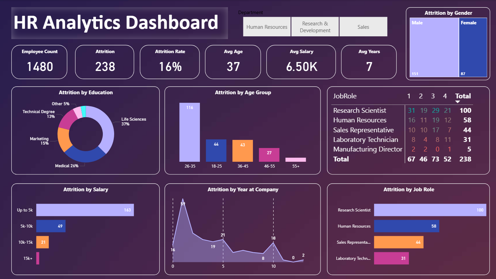
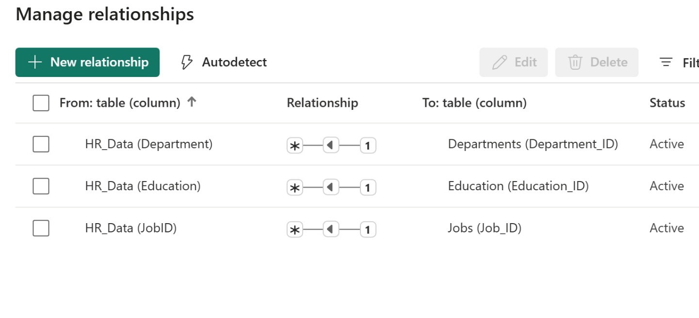

# HR Analytics Dashboard

## Project Overview

This project presents an interactive Human Resources (HR) Analytics Dashboard built using **Microsoft Power BI**. The dashboard is designed to provide critical insights into an organization's workforce, focusing on key HR metrics such as employee demographics, attrition patterns, and salary distributions. Leveraging advanced data modeling and DAX calculations, this solution empowers HR managers and executives to make data-driven decisions to improve employee retention and optimize workforce planning.

This project demonstrates strong capabilities in:
*   **Power BI Dashboard Development:** Creating a visually appealing and functional interactive report.
*   **Data Modeling & Relationships:** Designing an efficient star schema for robust data analysis.
*   **DAX (Data Analysis Expressions):** Crafting complex measures for key performance indicators (KPIs) like Attrition Rate.
*   **Data Transformation (Power Query):** (Implied) Preparing raw data for analysis.
*   **Data Visualization:** Selecting appropriate chart types to convey insights effectively.

## Live Interactive Dashboard

Experience the full interactivity of the HR Analytics Dashboard directly in your browser:

**➡️ [View the HR Analytics Dashboard on SharePoint](https://truman0-my.sharepoint.com/:u:/g/personal/sp3714_truman_edu/EdS3Tnx4T8pPmlfoCaHPMAUBKFcT5WWCXX4OEnJ36fabEw?e=dyECXG)**

## Dashboard Showcase

Here are snapshots of the dashboard and its underlying data model, demonstrating the project's visual and structural integrity:

### HR Analytics Dashboard Overview
This image provides a full view of the interactive dashboard, highlighting key performance indicators and visualization types.

### Data Model Relationships
A robust data model is crucial for accurate and flexible reporting. This screenshot shows the defined relationships between the core `HR_Data` table and various lookup dimensions (Departments, Education, Jobs), creating a star schema for efficient analysis.

## Key Insights from the Dashboard

The dashboard provides actionable insights into several HR aspects:

*   **Overall Workforce & Attrition:**
    *   **Employee Count:** 1480
    *   **Total Attrition:** 238
    *   **Attrition Rate:** 16%
    *   **Average Age:** 37
    *   **Average Salary:** 6.50K
    *   **Average Years at Company:** 7
*   **Attrition Demographics:**
    *   **By Education:** Life Sciences (37%) and Medical (26%) show the highest attrition.
    *   **By Age Group:** The **26-35 age group** experiences the highest attrition (116 individuals), indicating a critical retention challenge among early-to-mid career employees.
    *   **By Gender:** Male employees (151) show higher attrition than Female employees (87) in raw numbers.
    *   **By Salary:** The **"Up to 5k" salary bracket** accounts for the vast majority of attrition (163 incidents), suggesting that compensation might be a significant factor in employee turnover at lower salary levels.
    *   **By Job Role:** **Research Scientists** (100 attritions) and **Human Resources** (58 attritions) roles have the highest attrition counts.
*   **Attrition Trends:**
    *   **By Year at Company:** Attrition appears highest in the early years (0-1 years), suggesting issues with onboarding or initial job fit, then declines significantly with increased tenure.

These insights enable stakeholders to quickly understand the current state of HR, pinpoint problem areas, and devise targeted strategies.

## Technical Aspects

*   **Data Source:** The analysis is powered by `HR_Data.xlsx`, which contains raw employee information.
*   **Data Modeling:** A star schema was implemented, connecting the central `HR_Data` fact table to dimension tables (e.g., `Departments`, `Education`, `Jobs`) using one-to-many relationships. This structure optimizes query performance and enhances data clarity.
*   **DAX Calculations:** Custom DAX measures were developed to derive key metrics beyond raw counts, including:
    *   `Attrition Rate`: Calculated as (`Total Attrition` / `Employee Count`).
    *   `Avg Age`, `Avg Salary`, `Avg Years`: Aggregations to provide averages across the employee base.
    *   Conditional formatting and dynamic titles where applicable.
*   **Interactive Slicers:** The dashboard includes interactive slicers for `Department` (Human Resources, Research & Development, Sales), allowing users to filter insights specific to each department.

## Repository Files

*   `HR_Analytics_Dashboard.pbix`: The main Power BI Desktop project file containing the data model, DAX measures, and dashboard design.
*   `HR_Data.xlsx`: The raw Excel data source used for this project.
*   `powerbi.png`: A screenshot of the completed HR Analytics Dashboard.
*   `relationship.png`: A screenshot of the data model relationships within Power BI.
*   `README.md`: This project documentation.

## How to Access and Explore

1.  **View Online (Recommended):** Click the SharePoint link at the top of this README to interact with the live dashboard directly in your web browser.
2.  **Download and Explore in Power BI Desktop:**
    *   Download the `HR_Analytics_Dashboard.pbix` file from this repository.
    *   Ensure you have [Microsoft Power BI Desktop](https://powerbi.microsoft.com/desktop/) installed on your Windows machine.
    *   Open the downloaded `.pbix` file in Power BI Desktop to examine the data model, DAX calculations, Power Query transformations, and individual visual configurations.
